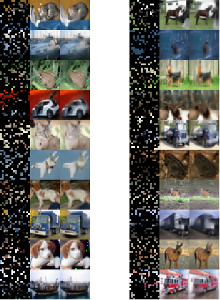

# MAE
PyTorch implementation of Masked AutoEncoder


## 1. MAE pretrain
- Train `MAE-ViT-Nano` on CIFAR10 dataset:

```Shell
python mae_pretrain.py --dataset cifar10 -m mae_vit_nano --batch_size 256 --img_size 32 --patch_size 2 --max_epoch 400 --wp_epoch 40
```

- Train `MAE-ViT-Nano` on ImageNet dataset:

```Shell
python mae_finetune.py --dataset imagenet_1k -m mae_vit_nano --batch_size 256 --img_size 224 --patch_size 16 --max_epoch 400 --wp_epoch 40
```

## 2. Train from scratch
- Train `ViT-Nano` on CIFAR10 dataset:

```Shell
python mae_finetune.py --dataset cifar10 -m vit_nano --batch_size 256 --img_size 32 --patch_size 2 --max_epoch 200 --wp_epoch 20
```

- Train `ViT-Nano` on ImageNet dataset:

```Shell
python mae_finetune.py --dataset imagenet_1k -m vit_nano --batch_size 256 --img_size 224 --patch_size 16 --max_epoch 200 --wp_epoch 20
```

## 3. Train from MAE pretrained
- Train `ViT-Nano` on CIFAR10 dataset:

```Shell
python mae_finetune.py --dataset cifar10 -m vit_nano --batch_size 256 --img_size 32 --patch_size 2  --max_epoch 50 --wp_epoch 5 --mae_pretrained path/to/mae_vit_nano_cifar10.pth
```

- Train `ViT-Nano` on ImageNet dataset:

```Shell
python mae_finetune.py --dataset imagenet_1k -m vit_nano --batch_size 256 --img_size 224 --patch_size 16 --max_epoch 50 --wp_epoch 5 --mae_pretrained path/to/mae_vit_nano_imagenet_1k.pth
```

## 4. Evaluate 
- Evaluate the `top1 & top5` accuracy of `ViT-Nano` on CIFAR10 dataset:
```Shell
python mae_finetune.py --dataset cifar10 -m vit_nano --batch_size 256 --img_size 32 --patch_size 2 --resume path/to/vit_nano_cifar10.pth
```

- Evaluate the `top1 & top5` accuracy of `ViT-Nano` on ImageNet-1K dataset:
```Shell
python mae_finetune.py --dataset imagenet_1k -m vit_nano --batch_size 256 --img_size 224 --patch_size 16 --resume path/to/vit_nano_imagenet_1k.pth
```


## 5. Visualize Image Reconstruction
- Evaluate `MAE-ViT-Nano` on CIFAR10 dataset:
```Shell
python mae_pretrain.py --dataset cifar10 -m mae_vit_nano --resume path/to/mae_vit_nano_cifar10.pth --img_size 32 --patch_size 2 --eval --batch_size 1
```

- Evaluate `MAE-ViT-Nano` on ImageNet-1K dataset:
```Shell
python mae_pretrain.py --dataset imagenet_1k -m mae_vit_nano --resume path/to/mae_vit_nano_imagenet_1k.pth --img_size 224 --patch_size 16 --eval --batch_size 1
```


## 6. Experiments
### 6.1 MAE pretrain
- Visualization on CIFAR10

Masked Image | Original Image | Reconstructed Image


- Visualization on ImageNet

...


### 6.2 Finutune
- On CIFAR10

|  Model   |  MAE pretrained  | Epoch | Top 1     | Weight |  MAE weight  |
|  :---:   |       :---:      | :---: | :---:     | :---:  |    :---:     |
| ViT-Nano |        No        | 200   | 77.7      | [ckpt](https://github.com/yjh0410/MAE/releases/download/checkpoints/vit_nano_cifar10.pth) | - |
| ViT-Nano |        Yes       | 50    | **89.4**  | [ckpt](https://github.com/yjh0410/MAE/releases/download/checkpoints/vit_nano_cifar10_finetune.pth) | [ckpt](https://github.com/yjh0410/MAE/releases/download/checkpoints/vit_nano_cifar10.pth)

- On ImageNet-1K

|  Model   |  MAE pretrained  | Epoch | Top 1 | Weight |
|  :---:   |       :---:      | :---: | :---: | :---:  |
| ViT-Nano |        No        | 200   |       |        |
| ViT-Nano |        Yes       | 50    |       |        |
